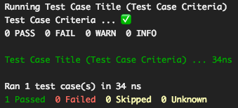
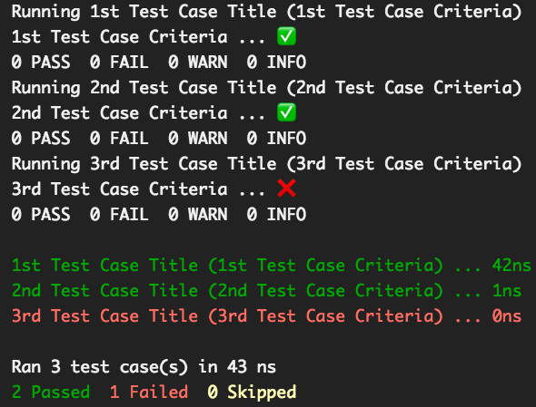
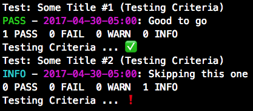
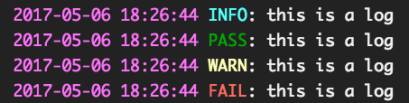

[](https://github.com/AlKass/polish/actions/workflows/ci.yml)
[](https://crates.io/crates/polish)
[](https://docs.rs/polish)
[](https://crates.io/crates/polish)
[](https://www.codacy.com/app/Alkass/polish?utm_source=github.com&amp;utm_medium=referral&amp;utm_content=Alkass/polish&amp;utm_campaign=Badge_Grade)
[](https://github.com/AlKass/polish/blob/master/License.md)

<div align="center">
  
</div>

# Polish
Polish es el Desarrollo Guiado por Pruebas (TDD) hecho como debe ser

[](https://asciinema.org/a/sDVhKPAB8elO5flUB5lb7Z10g)

## Primeros Pasos

### Instalando el Paquete

El paquete en `crates.io` se mantiene actualizado con todos los cambios importantes, lo que significa que puedes usarlo simplemente incluyendo lo siguiente en tu `Cargo.toml` bajo la sección de `dependencies`:

```yaml
polish = "*"
```

> Reemplaza `*` con el número de versión que se muestra en el badge de crates.io anterior

Pero si prefieres usar las versiones de desarrollo (nightly/más recientes), puedes incluir el repositorio de `GitHub` en su lugar:

```yaml
polish = { git = "https://github.com/alkass/polish", branch = "master" }
```

### Escribiendo Casos de Prueba

#### Casos de Prueba Individuales

El caso de prueba más simple puede tener la siguiente forma:

```rust
extern crate polish;

use polish::test_case::{TestRunner, TestCaseStatus, TestCase};
use polish::logger::Logger;

fn my_test_case(logger: &mut Logger) -> TestCaseStatus {
  // TODO: Your test case code goes here
  TestCaseStatus::PASSED // Other valid statuses are (FAILED, SKIPPED, and UNKNOWN)
}

fn main() {
  let test_case = TestCase::new("Test Case Title", "Test Case Criteria", Box::new(my_test_case));
  TestRunner::new().run_test(test_case);
}
```

Esto produce lo siguiente:



> El ejemplo anterior está disponible [aquí](examples/run_test.rs)

También puedes pasar un `closure` (cierre) de Rust en lugar de un puntero a función de la siguiente manera:

```rust
extern crate polish;

use polish::test_case::{TestRunner, TestCaseStatus, TestCase};
use polish::logger::Logger;

fn main() {
  let test_case = TestCase::new("Test Case Title", "Test Case Criteria", Box::new(|logger: &mut Logger| -> TestCaseStatus {
    // TODO: Your test case code goes here
    TestCaseStatus::PASSED
  }));
  TestRunner::new().run_test(test_case);
}
```

> El ejemplo anterior está disponible [aquí](examples/run_test_closure.rs)

#### Múltiples Casos de Prueba

Puedes ejecutar múltiples casos de prueba de la siguiente manera:

```rust
extern crate polish;

use polish::test_case::{TestRunner, TestCaseStatus, TestCase};
use polish::logger::Logger;

fn main() {
  let mut runner = TestRunner::new();
  runner.run_test(TestCase::new("1st Test Case Title", "Test Case Criteria", Box::new(|logger: &mut Logger| -> TestCaseStatus {
    // TODO: Your test case code goes here
    TestCaseStatus::PASSED
  })));
  runner.run_test(TestCase::new("2nd Test Case Title", "Test Case Criteria", Box::new(|logger: &mut Logger| -> TestCaseStatus {
    // TODO: Your test case code goes here
    TestCaseStatus::PASSED
  })));
  runner.run_test(TestCase::new("3rd Test Case Title", "Test Case Criteria", Box::new(|logger: &mut Logger| -> TestCaseStatus {
    // TODO: Your test case code goes here
    TestCaseStatus::PASSED
  })));
}
```

Pero una forma más conveniente sería pasar un `Vector` de tus casos de prueba a `run_tests` de la siguiente manera:

```rust
extern crate polish;

use polish::test_case::{TestRunner, TestCaseStatus, TestCase};
use polish::logger::Logger;

fn main() {
    let my_tests = vec![
      TestCase::new("1st Test Case Title", "1st Test Case Criteria", Box::new(|logger: &mut Logger| -> TestCaseStatus {
        // TODO: Your test case goes here
        TestCaseStatus::PASSED
      })),
      TestCase::new("2nd Test Case Title", "2nd Test Case Criteria", Box::new(|logger: &mut Logger| -> TestCaseStatus {
        // TODO: Your test case goes here
        TestCaseStatus::UNKNOWN
      })),
      TestCase::new("3rd Test Case Title", "3rd Test Case Criteria", Box::new(|logger: &mut Logger| -> TestCaseStatus {
        // TODO: Your test case goes here
        TestCaseStatus::FAILED
      }))];
    TestRunner::new().run_tests(my_tests);
}
```

Esto produce lo siguiente:



> El ejemplo anterior está disponible [aquí](examples/run_tests.rs)

#### Casos de Prueba Incrustados

Puedes optar por tener un conjunto de casos de prueba como parte de un objeto para probar ese mismo objeto. Para ello, una forma limpia de escribir tus casos de prueba es implementar el trait `Testable`. A continuación se muestra un ejemplo:

```rust
extern crate polish;

use polish::test_case::{TestRunner, TestCaseStatus, TestCase, Testable};
use polish::logger::Logger;

struct MyTestCase;
impl Testable for MyTestCase {
  fn tests(self) -> Vec<TestCase> {
    vec![
      TestCase::new("Some Title #1", "Testing Criteria", Box::new(|logger: &mut Logger| -> TestCaseStatus {
        // TODO: Your test case goes here
        TestCaseStatus::PASSED
      })),
      TestCase::new("Some Title #2", "Testing Criteria", Box::new(|logger: &mut Logger| -> TestCaseStatus {
      // TODO: Your test case goes here
      TestCaseStatus::SKIPPED
    }))]
  }
}

fn main() {
  TestRunner::new().run_tests_from_class(MyTestCase {});
}
```

Esto produce lo siguiente:



> El ejemplo anterior está disponible [aquí](examples/run_tests_from_class.rs)

### Atributos

Los atributos te permiten cambiar el comportamiento de cómo se ejecutan tus casos de prueba. Por ejemplo, de manera predeterminada, tu instancia de `TestRunner` ejecutará todos tus casos de prueba independientemente de si alguno ha fallado. Sin embargo, si deseas cambiar este comportamiento, deberás indicarle explícitamente a tu instancia de `TestRunner` que detenga el proceso ante el primer fallo.

ESTA CARACTERÍSTICA AÚN ESTÁ EN DESARROLLO. ESTE DOCUMENTO SE ACTUALIZARÁ CON DETALLES TÉCNICOS UNA VEZ QUE LA CARACTERÍSTICA ESTÉ COMPLETA.

### Registro (Logging)

El objeto `logger` que se pasa a cada caso de prueba ofrece 4 funciones de registro (`pass`, `fail`, `warn` y `info`). Cada una de estas funciones toma un argumento `message` (mensaje) de tipo `String`, lo que te permite usar la macro `format!` para formatear tus registros, por ejemplo:

```rust
logger.info(format!("{} + {} = {}", 1, 2, 1 + 2));
logger.pass(format!("{id}: {message}", id = "alkass", message = "this is a message"));
logger.warn(format!("about to fail"));
logger.fail(format!("failed with err_code: {code}", code = -1));
```

Esto produce lo siguiente:



> El ejemplo anterior está disponible [aquí](examples/logs.rs)

> Si el estado de retorno de tu caso de prueba es `UNKNOWN` y has impreso al menos un registro `fail` dentro de la función del caso de prueba, el resultado de tu caso de prueba se marcará como `FAILED`. De lo contrario, se marcará como `PASSED`.

## Autor

[Fadi Hanna Al-Kass](https://github.com/alkass)
