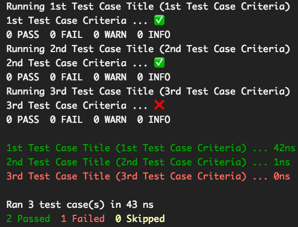
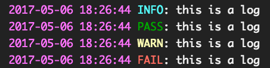

[](https://travis-ci.org/AlKass/polish)

[](https://codeship.com/projects/217937)
[](https://dependencyci.com/github/AlKass/polish)
[](https://codecov.io/gh/AlKass/polish)
[](https://ci.appveyor.com/project/alkass/polish)
[](https://crates.io/crates/polish)

[](https://crates.io/crates/polish)

[](https://github.com/AlKass/polish/blob/master/License.md)

<div align="center">
  
</div>

# Polish

`Polish` is a test framework designed to allow the construction of test-driven development processes written in `Rust`.

## Getting Started

### Installing the Package

The `crates.io` package is kept up-to-date with all the major changes which means you can use it by simply including the following in your `Cargo.toml` under your `dependencies` section:

```yaml
polish = "*"
```

> Replace `*` with the version number shown in the crates.io badge above

But if you'd like to use nightly (most recent) releases, you can include the `GitHub` package repo instead:

```yaml
polish = { git = "https://github.com/alkass/polish", branch = "master" }
```

### Writing Test Cases

#### single Test Cases

The simplest test case can take the following form:

```rust
extern crate polish;

use polish::test_case::{TestRunner, TestCaseStatus, TestCase};
use polish::logger::Logger;

fn my_test_case(logger: &mut Logger) -> TestCaseStatus {
  // TODO: Your test case code goes here
  TestCaseStatus::PASSED // Other valid statuses are (FAILED, SKIPPED, and UNKNOWN)
}

fn main() {
  let test_case = TestCase::new("Test Case Title", "Test Case Criteria", Box::new(my_test_case));
  TestRunner::new().run_test(test_case);
}
```

This produces the following:


> The example listed above is available [here](examples/run_test.rs)

You can also pass a `Rust closure` instead of a function pointer as so:

```rust
extern crate polish;

use polish::test_case::{TestRunner, TestCaseStatus, TestCase};
use polish::logger::Logger;

fn main() {
  let test_case = TestCase::new("Test Case Title", "Test Case Criteria", Box::new(|logger: &mut Logger| -> TestCaseStatus {
    // TODO: Your test case code goes here
    TestCaseStatus::PASSED
  }));
  TestRunner::new().run_test(test_case);
}
```

> The example listed above is available [here](examples/run_test_closure.rs)

#### Multiple Test Cases

You can run multiple test cases as follows:

```rust
extern crate polish;

use polish::test_case::{TestRunner, TestCaseStatus, TestCase};
use polish::logger::Logger;

fn main() {
  let mut runner = TestRunner::new();
  runner.run_test(TestCase::new("1st Test Case Title", "Test Case Criteria", Box::new(|logger: &mut Logger| -> TestCaseStatus {
    // TODO: Your test case code goes here
    TestCaseStatus::PASSED
  })));
  runner.run_test(TestCase::new("2nd Test Case Title", "Test Case Criteria", Box::new(|logger: &mut Logger| -> TestCaseStatus {
    // TODO: Your test case code goes here
    TestCaseStatus::PASSED
  })));
  runner.run_test(TestCase::new("3rd Test Case Title", "Test Case Criteria", Box::new(|logger: &mut Logger| -> TestCaseStatus {
    // TODO: Your test case code goes here
    TestCaseStatus::PASSED
  })));
}
```

But a more convenient way would be to pass a `Vector` of your test cases to `run_tests` as so:

```rust
extern crate polish;

use polish::test_case::{TestRunner, TestCaseStatus, TestCase};
use polish::logger::Logger;

fn main() {
    let my_tests = vec![
      TestCase::new("1st Test Case Title", "1st Test Case Criteria", Box::new(|logger: &mut Logger| -> TestCaseStatus {
        // TODO: Your test case goes here
        TestCaseStatus::PASSED
      })),
      TestCase::new("2nd Test Case Title", "2nd Test Case Criteria", Box::new(|logger: &mut Logger| -> TestCaseStatus {
        // TODO: Your test case goes here
        TestCaseStatus::UNKNOWN
      })),
      TestCase::new("3rd Test Case Title", "3rd Test Case Criteria", Box::new(|logger: &mut Logger| -> TestCaseStatus {
        // TODO: Your test case goes here
        TestCaseStatus::FAILED
      }))];
    TestRunner::new().run_tests(my_tests);
}
```

This produces the following:



> The example listed above is available [here](examples/run_tests.rs)

#### Embedded Test Cases

You may choose to have a set of test cases as part of an object to test that object itself. For that, a clean way of writing your test cases would be to implement the `Testable` trait. Following is an example:

```rust
extern crate polish;

use polish::test_case::{TestRunner, TestCaseStatus, TestCase, Testable};
use polish::logger::Logger;

struct MyTestCase;
impl Testable for MyTestCase {
  fn tests(self) -> Vec<TestCase> {
    vec![
      TestCase::new("Some Title #1", "Testing Criteria", Box::new(|logger: &mut Logger| -> TestCaseStatus {
        // TODO: Your test case goes here
        TestCaseStatus::PASSED
      })),
      TestCase::new("Some Title #2", "Testing Criteria", Box::new(|logger: &mut Logger| -> TestCaseStatus {
      // TODO: Your test case goes here
      TestCaseStatus::SKIPPED
    }))]
  }
}

fn main() {
  TestRunner::new().run_tests_from_class(MyTestCase {});
}
```

This produces the following:


> The example listed above is available [here](examples/run_tests_from_class.rs)

### Attributes

Attributes allow you to change the behaviour of how your test cases are run. For instance, by default, your `TestRunner` instance will run all your test cases regardless of whether any have failed. If you, however, want this behaviour changed, you will need to specifically tell your `TestRunner` instance to stop the process at the first failure.

THIS FEATURE IS STILL WORK-IN-PROGRESS. THIS DOCUMENT WILL BE UPDATED WITH TECHNICAL DETAILS ONCE THE FEATURE IS COMPLETE.

### Logging

The logger object that's passed to each test case offers 4 logging functions (`pass`, `fail`, `warn`, and `info`). Each of these functions take a `message` argument of type `String` which allows you to use the `format!` macro to format your logs, e.g.:

```rust
logger.info(format!("{} + {} = {}", 1, 2, 1 + 2));
logger.pass(format!("{id}: {message}", id = "alkass", message = "this is a message"));
logger.warn(format!("about to fail"));
logger.fail(format!("failed with err_code: {code}", code = -1));
```

This produces the following:



> The example listed above is available [here](examples/logs.rs)

> If your test case return status is `UNKNOWN` and you've printed at least one `fail` log from within the test case function, your test case result will be marked as `FAILED`. Otherwise, your test case will be marked as `PASSED`.

## Author

[Fadi Hanna Al-Kass](https://github.com/alkass)
