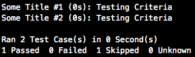

[](https://travis-ci.org/AlKass/polish)
[](https://opensource.org/licenses/MIT)


# Polish

`Polish` is a mini testing framework for the `Rust` system programming language meant to allow the writing of test-driven applications in a unified and expressive manner.

## Getting Started

Add the following under `[dependencies]` inside your project's `Cargo.toml` file:

```yaml
polish = { git = "https://github.com/alkass/polish", branch = "next" }
```

At minimum, you'll need the following:

```rust
extern crate polish;

use polish::test_case::{TestCase, TestCaseStatus};
use polish::logger::Logger;
```

> `TestCase` is the object you'll use to instantiate your test case(s)

> `TestCaseStatus` is an enum of 4 possible options (`PASSED`, `FAILED`, `SKIPPED`, and `UNKNOWN`). One of these options will need to be returned from each test case, and therefore, `TestCaseStatus` must be the return type of every test case you write.

The bare minimum for a syntactically valid test case would look like this:

```rust
TestCase::new("Test Case Title", "Test Case Criteria", Box::new(|logger: &mut Logger| -> TestCaseStatus {
    // TODO: Implement your test case here
    TestCaseStatus::PASSED // This is the return value
}));
```

if you want to log some formatted output, you can use the logger object that's passed to your test case.

Logger has 4 logging functions you can use (`pass`, `fail`, `info`, `warn`). These functions take a `message` of type `String` which means you can pass formatted text to it using the `format!` macro, e.g.:

```rust
logger.info(format!("this is some info"));
```

These logging statements are counted by the logger object, and the final statistics are shown to you at the end of the execution of each test case.

> Note that the `fail` function doesn't cause your application to halt.

> You can use the built-in `print!` and `println!` macros to log your output just fine, but `Logger` will better format your logs.

### Putting it All Together

To run a single test case, include the `run_test` function from `polish::test_case` as follows:

```rust
use polish::test_case::run_test
```

Implement your test case as follows:

```rust
let my_test_case = TestCase::new("Test Case Title", "Test Case Criteria", Box::new(|logger: &mut Logger| -> TestCaseStatus {
    logger.pass(format!("Good to go"));
    TestCaseStatus::PASSED
}))
```

And then pass your test case to the `run_test` function:

```rust
run_test(my_test_case);
```

And that's it! Your test case is ready to roll ^_^

This test case produces the following output:


> `run_test` has a return value, but we'll get back to that later.

> This single test case demo is available [here](examples/run_test.rs)

### Working with Multiple Test Cases

If you have multiple test cases to work with, you can store them in a vector and pass them to `run_tests` instead of `run_test`, e.g.:

```rust
let my_test_cases = vec![
TestCase::new("1st Test Case Title", "1st Test Case Criteria", Box::new(|logger: &mut Logger| -> TestCaseStatus {
  logger.pass(format!("Good to go"));
  TestCaseStatus::PASSED
})),
TestCase::new("2nd Test Case Title", "2nd Test Case Criteria", Box::new(|logger: &mut Logger| -> TestCaseStatus {
  logger.warn(format!("This is a warning"));
  TestCaseStatus::UNKNOWN
})),
TestCase::new("3rd Test Case Title", "3rd Test Case Criteria", Box::new(|logger: &mut Logger| -> TestCaseStatus {
  logger.fail(format!("this is a failure"));
  TestCaseStatus::FAILED
}))
];
  run_tests(my_test_cases);
```

This produces the following output:


This test case demo is available [here](examples/run_tests.rs)

### Writing Tests as Part of an Object
You may have the desire to implement your object each with its own set of test cases. For that, you need to implement the `polish::test_case::Testable` `trait` in each of your objects, then pass each object to a function called `run_tests_from_class` you can include from `polish::test_case` as well, e,g.:

```rust
struct MyTestCase;
impl Testable for MyTestCase {
  fn tests (self) -> Vec<TestCase> {
    vec![
      TestCase::new("Some Title #1", "Testing Criteria", Box::new(|logger: &mut Logger| -> TestCaseStatus {
        logger.pass(format!("Good to go"));
        TestCaseStatus::PASSED
      })),
      TestCase::new("Some Title #2", "Testing Criteria", Box::new(|logger: &mut Logger| -> TestCaseStatus {
        logger.info(format!("Skipping this one"));
        TestCaseStatus::SKIPPED
      }))
    ]
  }
}
run_tests_from_class(MyTestCase{});
```

This produces the following:


This test case demo is available [here](examples/run_tests_from_class.rs)

### More Statistics
> All runner functions (`run_test`, `run_tests`, and `run_tests_from_class`) return a `TestCaseResults` object that can be passed to a function called `statify` for more statistical information, e,g.:

```rust
let res = run_tests_from_class(MyTestCase{});
statify(&res);
```

This produces the following:



> `statify` returns a boolean value that's `true` if no test cases returned `FAILED` or `UNKNOWN`.

## Author
[Fadi Hanna Al-Kass](https://github.com/alkass)
